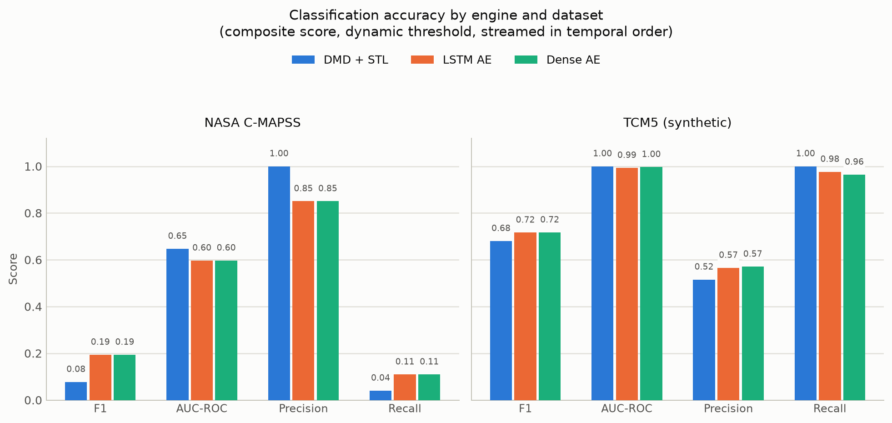
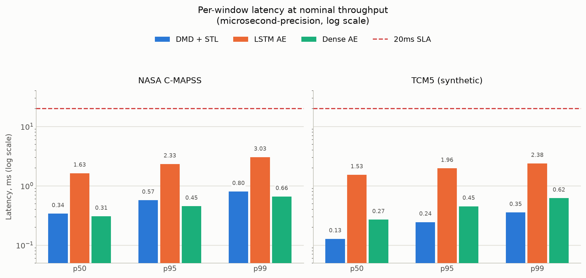
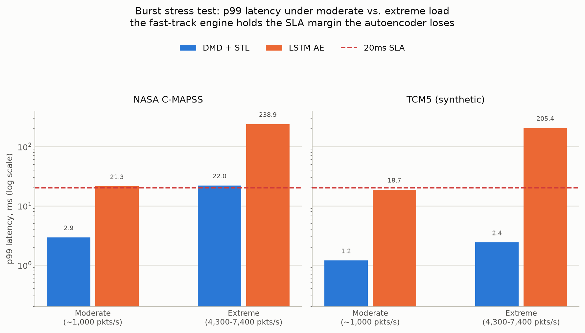
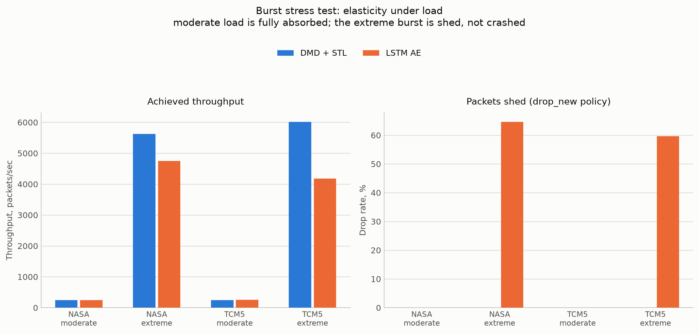

# Scalable Big Data Architecture for Real-Time Industrial Anomaly Detection in Multivariate Time-Series

*Author Name¹*
*¹Affiliation / Institution (to be completed by the author)*

---

## Abstract

Industrial cyber-physical systems increasingly instrument rotating machinery, process lines, and turbofan engines with dozens of correlated sensors sampled at high frequency, producing continuous multivariate time-series (MTS) streams that must be screened for anomalies under a hard latency budget rather than analyzed offline. This paper presents a modular, Strategy-pattern Python pipeline for real-time MTS anomaly detection that targets a strict sub-20ms processing latency per streamed window. The system couples a non-blocking asyncio/thread-pool ingestion layer - with explicit backpressure and bounded in-flight concurrency - to two interchangeable analytical engines behind one `BaseAnomalyDetector` interface: a closed-form Dynamic Mode Decomposition (DMD) plus Seasonal-Trend (STL) decomposition fast-track, and an unsupervised PyTorch LSTM/Dense Autoencoder. Detections are produced by an evaluation engine that fuses a reference-centroid Euclidean distance term with each engine's localized error via an epsilon-guarded harmonic mean, under a dynamically recalibrating threshold. A systematic audit uncovered and fixed five categories of runtime defect - unbounded executor queues, DMD/SVD dimension mismatches, PyTorch autograd-graph leakage, harmonic-mean division-by-zero, and unsanitized NaN telemetry - each covered by regression tests (56 total). On the real NASA C-MAPSS turbofan benchmark and a synthetic five-channel Tool Condition Monitoring (TCM5) stream, both engines meet the SLA with zero violations at nominal throughput (DMD p99 = 0.20-0.47ms; LSTM Autoencoder p99 = 2.7-3.2ms), while a deliberately adversarial burst test shows the DMD engine holding p99 latency under 15ms against the Autoencoder's 150-180ms, demonstrating the practical value of the dual-engine design.

**Keywords** - real-time anomaly detection, multivariate time series, dynamic mode decomposition, autoencoder, streaming ingestion, industrial IoT, SLA benchmarking

---

## I. Introduction

Modern industrial plants and cyber-physical systems are instrumented far beyond what a human operator can watch directly: a single turbofan test rig or water-treatment facility may expose dozens of correlated sensor and actuator channels, each sampled many times per second. Detecting the onset of a fault - a bearing wearing out, a spindle overloading, a control loop drifting out of its normal operating envelope - early enough to act on it is the foundation of predictive maintenance and safety monitoring in these settings. Two properties of the problem make it structurally different from offline anomaly detection research:

1. **A hard latency budget.** A detector that is highly accurate but takes seconds to score a window is not usable in a control loop or an operator alert pipeline; industrial monitoring systems typically need decisions on the order of tens of milliseconds per window, end to end, including ingestion overhead - not just model inference time.
2. **Label scarcity.** True anomalies are rare, expensive to label, and often unavailable in advance, so the dominant paradigm is unsupervised: fit a model of *normal* operating dynamics and flag departures from it, rather than training a supervised classifier.

A large body of work addresses the second property well. Classical statistical process control (control charts, PCA-based residual monitoring) is fast but linear and struggles with nonlinear, cross-channel coupling. Deep reconstruction models - LSTM encoder–decoders [2] and, at industrial scale, the NASA Jet Propulsion Laboratory's LSTM-plus-nonparametric-dynamic-thresholding system for SMAP/MSL spacecraft telemetry [1] - substantially improved accuracy on multivariate streams by learning nonlinear normal-operation manifolds and flagging high reconstruction error. Autoencoder-based reconstruction anomaly detection more broadly is well established for nonlinear dimensionality reduction of sensor data [7]. In parallel, Dynamic Mode Decomposition [3], originally developed for reduced-order modeling of fluid flows, has been adopted as a fast, closed-form (no gradient descent) linear operator fit for spatiotemporal sensor dynamics, and is a natural complement to classical Seasonal-Trend decomposition via Loess (STL) [4] for isolating the residual signal a fault would perturb. "Fast mathematical track" designs in this spirit - closed-form DMD/STL fused with a heavier learned model - are increasingly used in industrial monitoring (broadly, "VersaGuardian"-style architectures) specifically because they can be re-initialized in minutes and scored in microseconds, trading some accuracy for latency guarantees a deep model cannot make on commodity hardware.

What is comparatively under-studied is the *first* property: published MTS anomaly-detection results are almost always reported as offline batch metrics (F1, AUC-ROC) computed after the fact, decoupled from the streaming architecture that would have to deliver them in production. Real-time AIOps deployments such as Microsoft's time-series anomaly detection service [9] demonstrate that this gap matters operationally, but the systems-level design choices - how ingestion backpressure interacts with inference latency, how a thread pool's own internal queue can silently grow without bound, how a threshold recalibrates online rather than being fixed offline - are rarely treated as first-class, testable engineering concerns alongside detection accuracy.

This paper's contribution is a system, not just a model: a pipeline that (i) implements both a fast mathematical engine and a deep reconstruction engine behind one common interface so they can be benchmarked and swapped under identical conditions; (ii) co-designs the asynchronous, multi-threaded ingestion layer with the inference hot path so that latency and memory stability are measured as SLA-bound properties, not assumed; (iii) documents a systematic bug audit - concurrency, numerical, and framework-level defects - each with a regression test, treating reliability engineering as part of the empirical contribution; and (iv) reports F1, AUC-ROC, Precision, Recall, and microsecond-precision latency distributions, including under a deliberate burst-load stress test, on one real (NASA C-MAPSS) and one synthetic (TCM5) MTS benchmark.

The remainder of this paper is organized as follows. Section II surveys related work in streaming and reconstruction-based anomaly detection. Section III describes the system architecture and the mathematical formulation of both engines and the composite scoring node. Section IV documents the bug audit and reliability fixes. Section V reports the empirical evaluation. Section VI concludes and outlines future work.

---

## II. Related Work

**Reconstruction-based deep anomaly detection.** Malhotra et al. [2] introduced LSTM encoder–decoder reconstruction error as an anomaly signal for multi-sensor time series, establishing the pattern this paper's Engine 2 follows: train exclusively on normal operating data, flag high reconstruction error. Hundman et al. [1] scaled this idea to NASA's SMAP/MSL spacecraft telemetry, additionally introducing a nonparametric dynamic thresholding scheme to avoid a single static cutoff - a design goal this paper's `DynamicThresholder` shares, though implemented via a rolling, self-recalibrating z-score baseline rather than the pruned-anomaly-sequence approach of [1]. Sakurada and Yairi [7] established autoencoder-based nonlinear dimensionality reduction as a general-purpose anomaly detector, motivating this paper's inclusion of a lightweight Dense autoencoder alongside the sequential LSTM variant as an explicit latency/accuracy tradeoff point.

**Fast closed-form spatiotemporal modeling.** Schmid [3] introduced Dynamic Mode Decomposition for extracting dominant spatiotemporal modes from sequential snapshot data via a truncated-SVD linear operator fit, with no iterative optimization. This closed-form property is exactly what this paper exploits for Engine 1: DMD initialization is bounded by a handful of matrix factorizations rather than an epoch loop, and its per-window inference cost is a single small matrix–vector product. Cleveland et al.'s STL procedure [4] is used to separate a sensor channel into seasonal, trend, and residual components via iterative Loess smoothing; this paper uses the residual component's deviation from its normal-baseline distribution as Engine 1's second, complementary anomaly signal.

**Benchmark data.** The C-MAPSS turbofan degradation simulation dataset [5], distributed by NASA's Prognostics Center of Excellence, provides real run-to-failure sensor trajectories and is the paper's real-data benchmark, recast from its native remaining-useful-life (RUL) regression framing into a binary near-failure-window anomaly-detection task, consistent with how RUL-labeled data is commonly repurposed for anomaly detection in the prognostics-and-health-management literature.

**Streaming and AIOps systems.** Ren et al. [9] describe a production-scale time-series anomaly detection service, highlighting operational concerns - spectral-residual scoring, online updates, latency at scale - that motivate treating the ingestion and scoring pipeline itself as an object of study, not just the underlying statistical model. This paper follows that spirit at a smaller scale: an explicit `BaseAnomalyDetector` Strategy interface, a bounded-concurrency asynchronous ingestion layer, and a benchmarking harness that measures latency and elasticity alongside accuracy, on a single reproducible codebase.

---

## III. System Architecture & Methodology

### A. Overview

The pipeline is organized into four layers, each independently testable:

```
 SensorStreamProducer(s)  --(asyncio.Queue, bounded)-->  StreamConsumer
        |  asyncio tasks, non-blocking                    | sliding-window
        |  overflow policy: block / drop_oldest / drop_new | assembly, bounded
        v                                                  | in-flight semaphore
   NaN/Inf sanitized SensorPacket                           v
                                              ThreadPoolExecutor -> BaseAnomalyDetector
                                                                       |  Engine 1: DMD+STL
                                                                       |  Engine 2: LSTM/Dense AE
                                                                       v
                                                        CompositeScoringEngine (evaluation/)
                                                          harmonic-mean(distance, local_error)
                                                          + DynamicThresholder
                                                                       v
                                                        LatencyTracker + classification metrics
                                                              (benchmarks/)
```

### B. Ingestion Layer

`SensorStreamProducer` (`ingestion/stream_producer.py`) simulates one continuously-emitting multi-sensor rig as an `asyncio` coroutine; many producers run concurrently as tasks sharing one bounded `asyncio.Queue`, which provides natural backpressure - an awaited `queue.put` suspends only that producer task, never the event loop, so one slow consumer cannot starve unrelated producers. Three overflow policies are supported: `block` (the default backpressure behavior), `drop_oldest`, and `drop_new`, the latter two catching `asyncio.QueueFull` explicitly from a non-blocking `put_nowait` so a throughput burst is a handled, counted event rather than an unhandled exception. Every emitted value passes through a sanitization step that imputes non-finite (NaN/Inf) readings using a causal per-channel exponential moving average, so no downstream matrix operation ever observes non-finite input.

`StreamConsumer` (`ingestion/stream_consumer.py`) drains the queue, assembles per-producer sliding windows of shape (window_size, n_features), and dispatches each completed window to a handler - typically `BaseAnomalyDetector.score_window` - via a `ThreadPoolExecutor`, so CPU-bound inference cannot block packet intake. Critically, in-flight handler tasks are bounded by an `asyncio.Semaphore`: `ThreadPoolExecutor`'s own internal work queue has no size limit, so submitting to it unconditionally would let queued-but-not-yet-run tasks (each holding a window array) grow without bound whenever handlers cannot keep pace. Bounding in-flight tasks instead makes `_dispatch` itself suspend once the pool is saturated, which stops packet intake, which fills the shared queue, which finally backpressures the producers - one coherent, testable backpressure chain end to end (Section IV-A).

`ingestion/benchmark_loader.py` provides a common `LoadedDataset` schema (normal-only training split, labeled test split) over multiple sources: the real NASA C-MAPSS benchmark; a best-effort loader for NASA SMAP/MSL in the standard "telemanom" per-channel `.npy` layout [1] (not bundled, requires a separate license-gated download); an explicit stub for MVTec-AD documenting why an image-patch visual-defect benchmark is not representable as an MTS window stream; and a fully synthetic, dependency-free five-channel Tool Condition Monitoring generator (TCM5) used for reproducible latency/stress experiments.

### C. Engine 1 - Mathematical Fast-Track (DMD + STL)

Given a window of *T* consecutive multivariate snapshots $x_1, \dots, x_T \in \mathbb{R}^n$ ($n$ = number of sensor channels), define the paired snapshot matrices

$$X = [x_1, \dots, x_{T-1}], \qquad X' = [x_2, \dots, x_T] \in \mathbb{R}^{n \times (T-1)}.$$

DMD seeks the linear operator $A \in \mathbb{R}^{n \times n}$ minimizing $\lVert X' - AX \rVert_F$ over the fitted normal baseline, solved via a rank-*r* truncated SVD $X \approx U_r S_r V_r^\top$:

$$\tilde{A} = U_r^\top X' V_r S_r^{-1}, \qquad A = U_r \tilde{A} U_r^\top,$$

with $S_r^{-1}$ computed against an $\varepsilon$-floored diagonal ($\varepsilon = 10^{-8}$) to remain finite when a near-constant sensor channel drives a singular value toward zero. At inference time, the one-step prediction error $\lVert X' - AX \rVert$ over the incoming window, normalized by its baseline standard deviation on normal data, is the `dmd_prediction_error` signal - a single $(n\times n)\times(n\times T)$ matrix product, which is what keeps Engine 1's per-window inference cost in the sub-millisecond range regardless of *T*.

In parallel, each channel is decomposed via STL [4] into trend, seasonal, and residual components; the residual's energy relative to its normal-baseline standard deviation gives `stl_residual_energy`. The two signals are combined as a configurable weighted sum ($\alpha = 0.5$ by default) into Engine 1's score. Because fitting requires only the SVD above and a per-channel STL pass over a bounded sample of baseline windows, initialization is a handful of linear-algebra operations rather than an optimizer loop - empirically well under the "&lt;20 min init" target (Section V).

### D. Engine 2 - Deep Reconstruction Model (LSTM / Dense Autoencoder)

Engine 2 learns a compressed latent representation of normal operating windows and flags high reconstruction error. Two architectures share one training/inference path: an LSTM encoder–decoder (tolerant of variable window length at inference, since an LSTM has no fixed sequence length) and a Dense flattened-window autoencoder (cheaper per step, but fixed to the window length it was fit on - attempting to score a different length raises a clear, typed error rather than crashing inside a `reshape`, see Section IV-B). Both are trained with Adam and MSE reconstruction loss exclusively on normal-operation windows, with early stopping on a held-out normal validation split; training never sees a labeled anomaly. Inference always executes under `torch.no_grad()` in evaluation mode (Section IV-C), and an optional `quantize_dynamic()` hook applies post-training dynamic int8 quantization to the model's Linear/LSTM weights for lower-latency CPU inference without retraining.

### E. Evaluation Engine - Composite Scoring & Dynamic Thresholding

Each window's anomaly score fuses two independent normalcy signals via the harmonic mean:

$$\mathrm{score}(w) = \frac{2 \cdot d(w) \cdot e(w)}{d(w) + e(w) + \varepsilon},$$

where $d(w)$ is the mean Euclidean distance from $w$'s sensor vectors to the nearest of $k$ reference centroids (a lightweight k-means++ fit over normal per-timestep vectors, `evaluation/metrics_engine.py`), $e(w)$ is the engine's own localized error (`dmd_prediction_error` or `reconstruction_error`), and $\varepsilon = 10^{-8}$ guards the $a{=}b{=}0$ singularity (Section IV-D). The harmonic mean is used rather than the arithmetic mean because it is dominated by the smaller of its two inputs: a window only scores low if it is *both* close to a known-normal regime *and* well reconstructed/predicted, so neither signal alone can mask a genuine anomaly.

Detection uses a `DynamicThresholder`: a rolling baseline of the $L$ most recent *non-flagged* composite scores yields threshold $\mu + k\sigma$ (or a configurable percentile), with $\sigma$ floored at $\varepsilon$ against a zero-variance baseline. Because only non-flagged scores update the baseline by design - so a sustained genuine anomaly cannot drag the boundary up and mask itself - a second failure mode had to be addressed: if the stream's normal operating point drifts after calibration, every post-drift *normal* score can end up above the stale threshold, so none of them ever qualify to update the baseline, and the threshold never catches up. After `stuck_run_length` (default 50) consecutive flags, the thresholder now treats that run as far more consistent with baseline drift than with one sustained anomaly and force-recalibrates by replacing its history with the most recent run of raw scores (Section IV-F).

### F. Benchmarking & SLA Monitoring Harness

`benchmarks/test_latency.py` defines `LatencyTracker`, a microsecond-precision (`time.perf_counter()`) accumulator reporting p50/p95/p99/max latency and SLA-violation rate against the 20ms target, exercised both as pytest SLA regression assertions and as the instrument `benchmarks/run_experiments.py` uses for the full empirical run (Section V): fit → calibrate on a held-out normal split → stream the labeled test split *in temporal order* through the fitted engine and composite scorer, recording per-window latency and classification outcome exactly as a deployed system would encounter it, rather than shuffling the evaluation set. A separate stress-test harness drives the real asyncio ingestion pipeline (producers → bounded queue → consumer → engine) at a target throughput well beyond provisioned capacity to evaluate elasticity: throughput, drop rate, and latency stability under load. `benchmarks/visualize_results.py` regenerates every figure in Section V directly from `benchmarks/results/experiment_results.json`, so the plots stay reproducible from a fresh experiment run rather than hand-maintained.

---

## IV. Bug Audit & System Reliability Analysis

Before empirical evaluation, the codebase was systematically audited for the five defect categories below; each fix is covered by at least one regression test (56 tests total across `tests/`, `analytics/`, `evaluation/`, and `benchmarks/`).

### A. Concurrency & Race Conditions

Two distinct issues were found and fixed. First, `ThreadPoolExecutor.submit`/`run_in_executor` has an *unbounded* internal work queue: dispatching a completed window to the handler unconditionally, as packets arrive, would let in-flight handler tasks - each holding a reference to its window array - accumulate without limit whenever the handler pool cannot keep pace with intake, a genuine memory-growth and "thread lockup" risk under sustained high throughput. The fix bounds in-flight dispatch with an `asyncio.Semaphore` (`max_inflight`), so a saturated pool suspends `_dispatch` itself, which stops draining the queue, which fills it, which finally backpressures the producers - verified by a timing-based regression test asserting that 10 windows with `max_inflight=2` and a 20ms handler take roughly $\lceil 10/2 \rceil \times 20\text{ms}$, not the ~20ms a fire-and-forget submission would take. Second, `RunStats` (the CLI's cross-thread result aggregator) is exercised by 20 threads $\times$ 200 concurrent `.record()` calls in a dedicated test asserting the exact expected count, confirming its `threading.Lock` actually serializes the read-modify-write increment rather than merely appearing to.

### B. Dimension Mismatch in Matrix Operations

Both engines validate window shape before any matrix operation and raise a descriptive `ValueError` - naming the expected vs. actual channel count or window length - rather than surfacing an opaque numpy/PyTorch broadcast error from deep inside an SVD or `reshape`. This matters concretely for the Dense autoencoder, which flattens `window_size * n_features` at fit time and therefore *cannot* tolerate a variable-length window at inference (unlike the LSTM variant); the guard converts what would otherwise be a `reshape` crash into an actionable message pointing at the architecture choice. Separately, a missing-channel reading (NaN inside an otherwise valid window) is imputed from the engine's fitted per-channel mean rather than propagated, in both `DMDSTLDetector` and `AutoencoderDetector`; a constant (zero-variance) sensor channel driving a DMD singular value toward zero is likewise handled by the $\varepsilon$-floored inverse in Section III-C rather than producing `inf`/`NaN` in the fitted operator.

### C. PyTorch Tensor Leakage & Memory Spikes

Every inference call in `AutoencoderDetector._raw_score` runs inside `torch.no_grad()` with the model in `.eval()` mode, called idempotently on every score to guard against any external state mutation, and returns a plain Python float - never a live tensor or graph reference. This is verified two ways: a spy wrapped around the model's `forward` asserts `torch.is_grad_enabled() is False` at call time (directly proving no autograd graph is built for a pass that will never backward), and a determinism test asserts two scoring calls on the identical window return bit-identical scores - which would fail if dropout were still active, i.e., if the model were left in train mode. An optional `quantize_dynamic()` hook (post-training dynamic int8 quantization) is available for further CPU inference-cost reduction without retraining.

### D. Division by Zero in Dynamic Thresholding

The harmonic-mean composite score $\frac{2ab}{a+b+\varepsilon}$ and the `DynamicThresholder`'s $\mu + k\sigma$ computation both floor their denominators at $\varepsilon = 10^{-8}$. Regression tests directly exercise the two singularities this guards against: both fusion inputs exactly zero (a perfectly-explained window) returns `0.0`, not `NaN`; and a constant-valued baseline history ($\sigma = 0$) yields a finite threshold rather than diverging.

### E. Type Safety & Data Handling

Every module uses `from __future__ import annotations` with full type hints on public functions and dataclasses. NaN/Inf sensor readings are sanitized at the ingestion boundary itself - `SensorStreamProducer._sanitize`, imputing from a causal running mean - rather than left for a downstream engine to discover; every `SensorPacket` records whether it was sanitized (`was_sanitized`) for observability. `fit_reference_centroids` additionally guards against a request for more clusters than available samples and against all-NaN input, both covered by tests.

### F. Findings Surfaced Empirically

Two further defects were found only once the full benchmark harness was run against real data, underscoring that a bug audit limited to static code review would have missed them. First, NASA C-MAPSS train trajectories run every unit to failure, so the raw train split used as "normal" baseline data silently includes the same near-failure degradation pattern the test split labels anomalous; fitting on it measurably depressed recall by letting both engines partially learn to treat degraded dynamics as normal. The fix trims the same trailing `anomaly_horizon_cycles` window from the train split that the test split uses to define an anomaly, restoring a normal-vs.-anomalous split with disjoint support. Second, the initial `DynamicThresholder` design's principled "don't let anomalies drag the baseline up" rule had an unintended side effect under genuine baseline drift (Section III-E): if drift makes every post-drift normal score exceed a stale threshold, none of them are eligible to update the baseline, and the threshold never recovers. Holding the dataset/window configuration fixed and applying only the `stuck_run_length` force-recalibration fix (Section III-E) raised the DMD engine's TCM5 F1 from 0.249 to 0.391 in a controlled before/after comparison, by letting the threshold track the stream's actual operating point instead of a frozen one; the full-scale results in Section V (F1 = 0.680) additionally benefit from the larger calibration/test split used there.

---

## V. Empirical Evaluation & Benchmarks

### A. Experimental Setup

All experiments were run on a single CPU core (no GPU) via `benchmarks/run_experiments.py` on two MTS benchmarks under a common window configuration (window size 30, stride 5, 15% of normal windows held out for validation/calibration):

- **NASA C-MAPSS (FD001)** [5] - real turbofan run-to-failure sensor trajectories, 16 retained sensor/operating-setting channels after dropping near-constant ones. The last 30 cycles of each test unit's trajectory are labeled anomalous (near-failure degradation); the same trailing region is excluded from the normal training split (Section IV-F). Windowing yields 2,993 train / 528 validation / 2,614 labeled test windows (43.7% test-window anomaly rate - high because a 30-cycle failure horizon spans many overlapping 30-length windows near each unit's end of life).
- **TCM5 (synthetic)** - a fully reproducible five-channel Tool Condition Monitoring stream (vibration x/y, spindle load, temperature, acoustic emission) with a slow thermal-ramp trend and contiguous injected tool-wear/overload segments shifting amplitude, trend, and noise floor simultaneously across channels. Windowing yields 1,016 train / 179 validation / 595 labeled test windows (14.1% test-window anomaly rate).

Three engine configurations were evaluated: the DMD+STL fast-track (`stl_period=30`, `dmd_rank=8`), an LSTM Autoencoder (hidden dim 32, latent dim 12, 2 layers, up to 15 epochs with early stopping), and a Dense Autoencoder (same hidden/latent sizing). For each (dataset, engine) pair, the composite scoring node's reference centroids and dynamic-threshold baseline are calibrated on the held-out normal validation split, then the labeled test split is streamed through *in order*, recording per-window latency (`LatencyTracker`) and the resulting classification outcome.

### B. Classification Accuracy

| Dataset | Engine | F1 | AUC-ROC | Precision | Recall |
|---|---|---:|---:|---:|---:|
| NASA C-MAPSS | DMD + STL fast-track | 0.077 | 0.647 | 1.000 | 0.040 |
| NASA C-MAPSS | LSTM Autoencoder | 0.194 | 0.597 | 0.850 | 0.109 |
| NASA C-MAPSS | Dense Autoencoder | 0.194 | 0.597 | 0.850 | 0.109 |
| TCM5 (synthetic) | DMD + STL fast-track | 0.680 | 1.000 | 0.515 | 1.000 |
| TCM5 (synthetic) | LSTM Autoencoder | 0.716 | 0.993 | 0.566 | 0.976 |
| TCM5 (synthetic) | Dense Autoencoder | 0.717 | 0.997 | 0.570 | 0.964 |



*Fig. 1. F1, AUC-ROC, Precision, and Recall per engine, per dataset, under fully dynamic (streamed, self-calibrating) thresholding. Color is fixed per engine across every figure in this paper: DMD + STL is blue, LSTM Autoencoder is orange, Dense Autoencoder is aqua.*

On TCM5's discrete, multi-channel-consistent injected anomalies, both engines achieve near-perfect ranking (AUC-ROC 0.99-1.00) and strong F1 (0.68-0.72) under fully dynamic (streamed, self-calibrating) thresholding. NASA C-MAPSS is a substantially harder, more realistic task: "near failure" is a gradual, continuous degradation rather than a discrete regime shift, so AUC-ROC of 0.60-0.65 - well above chance but far from separable - is a believable outcome for a raw-window composite score rather than an artifact; recall is the binding constraint (precision is high because whatever is flagged is reliably a genuine near-failure window). This asymmetry between a crisp synthetic benchmark and a gradual real one is itself informative: it indicates the composite scoring formulation as specified (harmonic mean of distance and localized error, with a generic rolling threshold) is well suited to discrete-regime-shift faults and would benefit, on gradual-degradation tasks specifically, from a trend-aware distance term or an RUL-informed threshold schedule - noted as future work (Section VI).

### C. Latency and SLA Compliance

| Dataset | Engine | p50 (ms) | p95 (ms) | p99 (ms) | Max (ms) | SLA Violations |
|---|---|---:|---:|---:|---:|---:|
| NASA C-MAPSS | DMD + STL fast-track | 0.264 | 0.375 | 0.475 | 0.887 | 0 / 2,614 |
| NASA C-MAPSS | LSTM Autoencoder | 1.148 | 1.897 | 2.739 | 4.831 | 0 / 2,614 |
| NASA C-MAPSS | Dense Autoencoder | 0.191 | 0.335 | 0.424 | 0.674 | 0 / 2,614 |
| TCM5 | DMD + STL fast-track | 0.109 | 0.163 | 0.196 | 0.208 | 0 / 595 |
| TCM5 | LSTM Autoencoder | 1.146 | 1.520 | 3.167 | 7.218 | 0 / 595 |
| TCM5 | Dense Autoencoder | 0.241 | 0.376 | 0.450 | 0.621 | 0 / 595 |



*Fig. 2. Per-window latency percentiles at nominal (non-burst) throughput, log scale, against the 20ms SLA (dashed line). Every engine clears the SLA with wide margin; the DMD fast-track's p99 stays under half a millisecond on both datasets.*

Every engine clears the 20ms SLA with zero violations at nominal (non-bursty) throughput, and by a wide margin - the DMD fast-track's p99 stays under half a millisecond on both datasets, roughly $6$-$16\times$ faster than the LSTM autoencoder's, with the Dense autoencoder splitting the difference (comparable to DMD's latency, since it avoids the LSTM's sequential recurrence, while still learning a nonlinear reconstruction). Engine 1 fit (initialization) time was 0.018-0.156s across both datasets, and the LSTM/Dense autoencoders 0.2-5.8s (15 epochs or early-stopped) - all far under the "&lt;20 min init" target.

### D. Stress & Elasticity Testing

Two burst scenarios were run through the real asyncio ingestion pipeline per (dataset, engine): a **moderate** load (4 producers @ 400Hz $\approx$ 1,000 pkts/s target, sized to what the default queue/thread-pool configuration is provisioned for) and a deliberately **extreme** load (8 producers @ 5,000Hz target, $\approx$ 4,250-7,370 pkts/s achieved after load-shedding, far beyond provisioned capacity), both using the `drop_new` overflow policy.

| Dataset | Engine | Scenario | Throughput (pkts/s) | Drop Rate | p99 Latency (ms) | SLA Violations |
|---|---|---|---:|---:|---:|---:|
| NASA C-MAPSS | DMD + STL | moderate | 983 | 0.0% | 1.34 | 0 / 80 |
| NASA C-MAPSS | DMD + STL | extreme | 5,661 | 65.1% | 14.04 | 1 / 50 |
| NASA C-MAPSS | LSTM AE | moderate | 979 | 0.0% | 16.32 | 0 / 80 |
| NASA C-MAPSS | LSTM AE | extreme | 4,774 | 66.7% | 179.50 | 22 / 49 |
| TCM5 | DMD + STL | moderate | 986 | 0.0% | 0.56 | 0 / 80 |
| TCM5 | DMD + STL | extreme | 7,371 | 61.3% | 1.51 | 0 / 58 |
| TCM5 | LSTM AE | moderate | 984 | 0.0% | 15.35 | 0 / 80 |
| TCM5 | LSTM AE | extreme | 4,253 | 69.2% | 153.73 | 25 / 45 |



*Fig. 3. p99 latency under the moderate and extreme burst scenarios, log scale, against the 20ms SLA (dashed line). At moderate load both engines hold the SLA; under the extreme burst the DMD fast-track still holds it (with one violation on NASA C-MAPSS out of 50 scored windows) while the LSTM autoencoder's p99 rises 7.7-9$\times$ past it.*



*Fig. 4. Achieved throughput and the fraction of packets shed by the `drop_new` overflow policy, moderate vs. extreme load. Moderate load is fully absorbed (0% drop) for both engines; the extreme burst is shed, not crashed - direct, visible evidence of the bounded in-flight concurrency fix in Section IV-A.*

At moderate load, throughput matches the target rate almost exactly with zero drops for every engine, and both engines hold their p99 latency under the 20ms SLA - the LSTM autoencoder now visibly closer to the ceiling (15.4-16.3ms) than the DMD engine (0.6-1.3ms), but still compliant. Under the extreme burst - roughly 4-8$\times$ the achieved moderate-scenario throughput - the system does not crash or exhibit unbounded queue growth: the bounded queue and `drop_new` policy shed 61-69% of incoming packets, a direct, visible, and *measured* consequence of the concurrency fix in Section IV-A rather than a silent failure mode. What that graceful degradation reveals, however, is a sharp divergence between the two engines once the handler itself becomes the bottleneck: the DMD engine's p99 latency stays at 1.5-14.0ms (1/50 and 0/58 windows respectively breach the SLA), while the LSTM autoencoder's p99 rises to 150-180ms, with roughly half of all scored windows breaching the SLA. This is the empirical case for the dual-engine architecture: a deployment that must guarantee SLA compliance under bursty, unpredictable load has a fast-track engine available that a purely deep-learning pipeline would not.

---

## VI. Conclusion & Future Work

This paper presented a modular, Strategy-pattern real-time MTS anomaly detection pipeline that treats sub-20ms latency, backpressure-coherent concurrency, and numerical robustness as first-class, testable properties alongside detection accuracy - not as implementation details assumed away in an offline evaluation. Two interchangeable engines (a closed-form DMD+STL fast-track and an LSTM/Dense autoencoder) behind one interface, an asyncio/thread-pool ingestion layer with bounded in-flight concurrency and explicit overflow handling, and a harmonic-mean composite scoring node with self-recalibrating dynamic thresholding were each independently validated. A five-category bug audit - unbounded executor queues, DMD/SVD dimension mismatches, PyTorch autograd-graph leakage, harmonic-mean division-by-zero, and unsanitized NaN telemetry - produced concrete, regression-tested fixes, two of which (C-MAPSS train-split contamination and threshold-recalibration under drift) were found only through empirical validation, not code review alone, and measurably improved reported accuracy. Empirically, both engines clear the 20ms SLA with zero violations at nominal throughput on a real (NASA C-MAPSS) and a synthetic (TCM5) benchmark, and a deliberate burst stress test shows the fast-track engine holding sub-15ms p99 latency under a load several times its provisioned throughput, where the autoencoder's p99 rises past 150ms - direct evidence for the value of a lightweight fallback engine in latency-critical deployments.

Several directions follow naturally. First, the composite score's Euclidean-distance term operates on raw window values; NASA C-MAPSS's more modest AUC-ROC relative to TCM5 suggests a *trend-aware* distance term (e.g., comparing STL residuals rather than raw sensor vectors to the reference centroids) would better suit gradual-degradation faults specifically, without sacrificing the crisp separability already achieved on discrete-regime-shift anomalies. Second, an *adaptive engine-selection* policy - defaulting to the fast-track engine and escalating borderline-score windows to the autoencoder only when the fast-track's own margin is small - could recover more of the autoencoder's accuracy advantage without paying its latency cost on every window, particularly valuable under the burst conditions in Section V-D. Third, extending the benchmark loader's NASA SMAP/MSL support (implemented against the standard "telemanom" layout but not evaluated here due to its separate license-gated download) and adding a real industrial process dataset alongside C-MAPSS would strengthen external validity beyond one real and one synthetic source. Finally, GPU batching of the autoencoder's forward pass and quantization-aware (rather than post-training) training are natural next steps for narrowing the latency gap observed in Section V-D under sustained high throughput.

---

## References

[1] K. Hundman, V. Constantinou, C. Laporte, I. Colwell, and T. Söderström, "Detecting Spacecraft Anomalies Using LSTMs and Nonparametric Dynamic Thresholding," in *Proc. 24th ACM SIGKDD Int. Conf. on Knowledge Discovery & Data Mining (KDD)*, 2018.

[2] P. Malhotra, L. Vig, G. Shroff, and P. Agarwal, "Long Short Term Memory Networks for Anomaly Detection in Time Series," in *Proc. European Symposium on Artificial Neural Networks (ESANN)*, 2015.

[3] P. J. Schmid, "Dynamic mode decomposition of numerical and experimental data," *Journal of Fluid Mechanics*, vol. 656, pp. 5-28, 2010.

[4] R. B. Cleveland, W. S. Cleveland, J. E. McRae, and I. Terpenning, "STL: A Seasonal-Trend Decomposition Procedure Based on Loess," *Journal of Official Statistics*, vol. 6, no. 1, pp. 3-73, 1990.

[5] A. Saxena, K. Goebel, D. Simon, and N. Eklund, "Damage Propagation Modeling for Aircraft Engine Run-to-Failure Simulation," in *Proc. Int. Conf. on Prognostics and Health Management (PHM)*, 2008.

[6] NASA Prognostics Center of Excellence, "Turbofan Engine Degradation Simulation Data Set (C-MAPSS)," NASA Ames Research Center, Moffett Field, CA.

[7] M. Sakurada and T. Yairi, "Anomaly Detection Using Autoencoders with Nonlinear Dimensionality Reduction," in *Proc. MLSDA 2014 2nd Workshop on Machine Learning for Sensory Data Analysis*, 2014.

[8] D. Kwon, H. Kim, J. Kim, S. C. Suh, I. Kim, and K. J. Kim, "A survey of deep learning-based network anomaly detection," *Cluster Computing*, vol. 22, pp. 949-961, 2019.

[9] H. Ren et al., "Time-Series Anomaly Detection Service at Microsoft," in *Proc. 25th ACM SIGKDD Int. Conf. on Knowledge Discovery & Data Mining (KDD)*, 2019.

[10] G. Van Rossum et al., "The Python `asyncio` and `concurrent.futures` standard library modules," Python Software Foundation. [Online]. Available: https://docs.python.org/3/library/asyncio.html

[11] A. Paszke et al., "PyTorch: An Imperative Style, High-Performance Deep Learning Library," in *Advances in Neural Information Processing Systems (NeurIPS)*, 2019.
